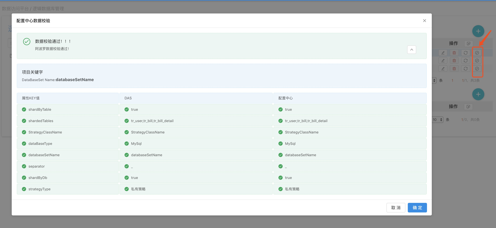

#### 在实际开发和使用时，我们如果需要引入配置中心，das-client从配置中心获取配置信息，需要在das-client和das-console分别接入对配置中心的读写操作的接口

#### 以下内容将详细说明每个页面按钮和对应的接口实现

## 一、在逻辑库管理页,实现增、删、改接口

&nbsp;&nbsp;&nbsp;&nbsp; 1、在增、删、改、同步逻辑库信息到数据中心，可以实现"ConfigProvider"的四个接口方法。

方法名 | 作用 | 说明 
 :-:| :-: | :-: |
addDataBaseSet | 添加逻辑库 | 参数为逻辑库信息list
updateDatabaseSet | 更新逻辑库信息| 参数为逻辑库信息
deleteDataBaseSet | 删除逻辑库 | 参数为逻辑库信息
getDatabaseSet | 获取逻辑库信息 | 参数为逻辑库名，具有唯一性

## 二、逻辑库数据同步到配置中心

&nbsp;&nbsp;&nbsp;&nbsp; 1、有的时候新建，修改时对数据中心的操作可能会失败，这时可以使用同步按钮同步逻辑库数据到配置中心，如图所示

&nbsp;&nbsp;&nbsp;&nbsp; 2、好了，这个时候点击同步按钮，就可以再次把逻辑库信息同步到配置中心了

## 三、数据校验
&nbsp;&nbsp;&nbsp;&nbsp; 1、查看配置中心和DAS数据是否一致，这个时候需要和DAS的数据进行比较，如果比较发现数据有差异，可以点击同步按钮恢复数据中心的逻辑库信息的配置。如图所示

&nbsp;&nbsp;&nbsp;&nbsp; 2、首先需要实现"ConfigProvider"的"getDatabaseSet"接口方法，此方法有一个参数（1、逻辑库名，具有唯一性）返回逻辑库信息，点击'校验按钮'会调用此方法。如图所示

&nbsp;&nbsp;&nbsp;&nbsp; 3、好了，如果数据有差异，可以点击同步按钮同步配置到配置中心

 

