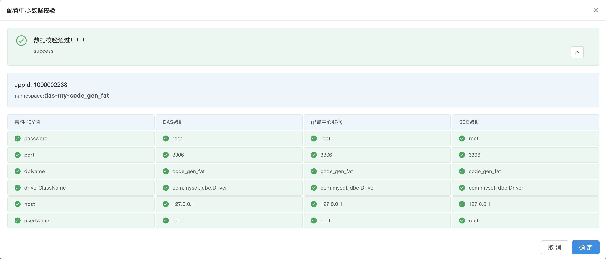
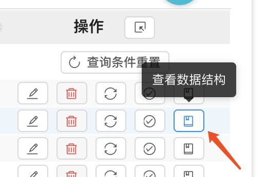

#### 在实际开发和使用时，如果需要引入配置中心，das-client从配置中心获取配置信息，需要在das-client和das-console分别接入对配置中心的读写操作的接口

#### 以下内容将详细说明每个页面按钮和对应的接口实现

## 一、在物理库管理页,实现增、删、改接口

&nbsp;&nbsp;&nbsp;&nbsp; 1、在增、删、改、同步，物理库信息到数据中心 ，可以实现"ConfigProvider"的四个接口方法。

方法名 | 作用 | 说明 
|:- |:- |:- 
addDataBase | 批量添加物理库 | 参数为物理库信息list
updateDataBase | 更新物理库信息| 参数为物理库信息
deleteDataBase | 删除物理库 | 参数为物理库名称，具有唯一性
getDataBase | 获取物理库信息 | 参数为物理库名称，具有唯一性

## 二、物理库数据同步到配置中心

&nbsp;&nbsp;&nbsp;&nbsp; 1、如果配置中心与DAS数据不一致，这时可以使用同步按钮同步项目数据到配置中心。

&nbsp;&nbsp;&nbsp;&nbsp; 2、需要实现"ConfigProvider"的"updateDataBase"接口方法，点击'同步按钮'会调用此方法。如图所示

## 三、数据校验
&nbsp;&nbsp;&nbsp;&nbsp; 1、如果需要查看配置中心和DAS数据是否一致，这个时候需要和DAS的数据进行比较，如果比较发现数据有差异，可以点击同步按钮恢复数据中心的物理库信息的配置。

&nbsp;&nbsp;&nbsp;&nbsp; 2、首先需要实现"ConfigProvider"的"getDataBase"接口方法，此方法有一个参数（物理库名），返回物理库信息，点击'校验按钮'会调用此方法。如图所示

 
## 四、查看表结构
&nbsp;&nbsp;&nbsp;&nbsp; 1、管理员如果需要查看表结构，这里可以点击按钮'查看表结构'查看

&nbsp;&nbsp;&nbsp;&nbsp; `注意` DataBaseVO 属性说明

属性名 | 说明 
|:- |:- 
dataBaseEnum  | 数据库类型 1、MySql 或 2.SqlServer
dbName | 数据库名
userName | 用户名
password | 密码
port | 端口
host | 地址

