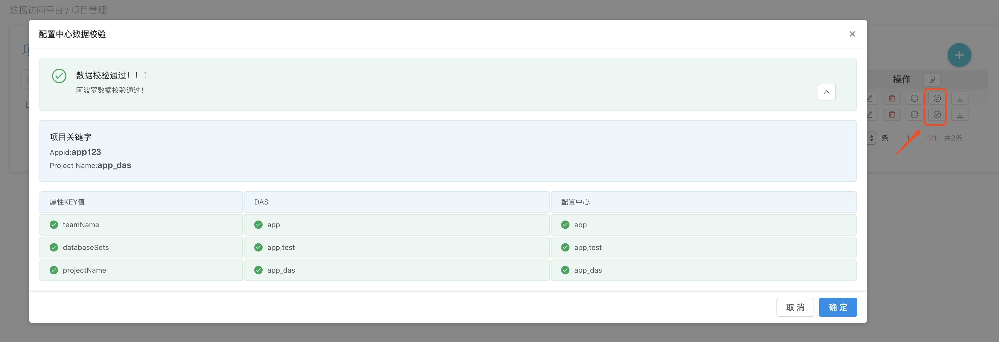

#### 在实际开发和使用时，如果需要引入配置中心，das-client从配置中心获取配置信息，需要在das-client和das-console分别接入对配置中心的读写操作的接口

#### 以下内容将详细说明每个页面按钮和对应的接口实现

## 一、在项目管理页,实现增、删、改接口

&nbsp;&nbsp;&nbsp;&nbsp; 1、在增、删、改、同步项目信息对应到数据中心，可以实现ConfigProvider四个接口方法。

方法名 | 作用 | 说明 
- | :-: | :-: | :-: | -:
addProject | 添加项目 | 参数为项目信息
updateProject | 更新项目，同步项目 |  参数为项目信息
deleteProject | 删除项目 |  参数为项目appid，具有唯一性
getProject | 获取项目信息 |  参数为项目appid，具有唯一性

## 二、项目数据同步到配置中心

&nbsp;&nbsp;&nbsp;&nbsp; 1、如果配置中心与DAS数据不一致，这时可以使用同步按钮同步项目数据到配置中心。

&nbsp;&nbsp;&nbsp;&nbsp; 2、需要实现"ConfigProvider"的"updateProject"接口方法，点击'同步按钮'会调用此方法。如图所示

## 三、数据校验
&nbsp;&nbsp;&nbsp;&nbsp; 1、如果需要查看配置中心和DAS数据是否一致，这个时候需要和DAS的数据进行比较，如果比较发现数据有差异，可以点击同步按钮恢复数据中心的项目信息的配置

&nbsp;&nbsp;&nbsp;&nbsp; 2、首先需要实现"ConfigProvider"的"getProject"接口方法，此方法有一个参数（项目appid）返回项目信息，点击'校验按钮'会调用此方法。如图所示

&nbsp;&nbsp;&nbsp;&nbsp; `注意` ProjectVO 属性说明

属性名 | 作用 | 说明 
- | :-: | :-: | :-: 
appId | 项目appid | 具有唯一性
projectName | 项目名| 具有唯一性
teamName | 组名| 具有唯一性
databaseSetNames | 逻辑库名 | 逻辑库名列表

 

